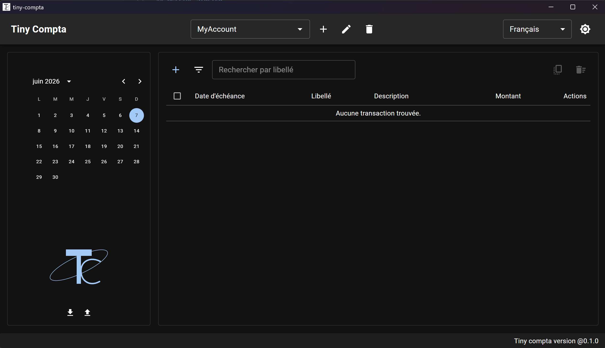

# Tiny Compta

**Tiny Compta** is a lightweight, browser-based bank account management application for personal finance tracking. It lets you manage multiple bank accounts, track associated transactions, and manage recurring payment plans with automatic monthly generation. Features also include data importing/exporting (transactions and recurring payment plans) and real-time balance calculation based on an end date.



## Features

- **Dashboard:** Interactive tracking of cumulative/daily inflows and outflows with MUI X-Charts, including account balances (today and forecasted end-of-month) and detailed tables of non-recurring incomes.
- Manage multiple bank accounts
- Track transactions with labels, descriptions, amounts, and due dates
- Manage recurring payment plans with custom intervals, start/end dates, and automatic/manual generation
- Import and export transaction and recurring payment data (JSON and CSV formats)
- Real-time balance calculation
- Persistent storage via IndexedDB
- Multi-language support (English & French)

## Tech Stack

- **Framework:** React 19 + TypeScript + Vite
- **UI:** Material UI (MUI) 9
- **Charts:** MUI X-Charts
- **Dates:** Day.js + MUI X Date Pickers
- **Persistence:** IndexedDB (`idb`)
- **i18n:** i18next + react-i18next
- **Testing:** Vitest + React Testing Library

## Getting Started

### Prerequisites

- [Node.js](https://nodejs.org/) (v20+ recommended)

### Installation

```bash
npm install
```

### Development

```bash
npm run dev
```

The app will be available at `http://localhost:5173`.

### Build

```bash
npm run build
```

### Preview Production Build

```bash
npm run preview
```

### Lint

```bash
npm run lint
```

### Tests

```bash
npm run test
```

### Build Desktop App (Tauri v2)

> **Prerequisites:** Rust toolchain + Node.js

Install Rust (if not already installed):

```bash
curl --proto '=https' --tlsv1.2 -sSf https://sh.rustup.rs | sh
```

#### Linux (Manjaro/Arch)

Install required system dependencies:

```bash
sudo pacman -S webkit2gtk-4.1 libappindicator-gtk3 librsvg
```

#### macOS

No additional dependencies required.

#### Windows

WebView2 is included with Windows 10/11. No additional dependencies required.

#### Build & Bundle

In Tauri v2, bundling is explicit. Choose your target:

```bash
npm run tauri build -- --bundles deb      # Debian package (.deb)
npm run tauri build -- --bundles rpm       # RPM package (.rpm)
npm run tauri build -- --bundles msi       # Windows MSI installer (.msi)
npm run tauri build -- --bundles nsis      # Windows NSIS installer (.exe)
npm run tauri build -- --bundles all       # All available bundles for current platform
```

**AppImage (Linux):**

AppImage bundling requires the `NO_STRIP=true` environment variable:

```bash
NO_STRIP=true npm run tauri build -- --bundles appimage
```

No additional tools (like linuxdeploy) are needed — Tauri bundles everything automatically.

**Install the packages:**

- **Debian/Ubuntu:** `sudo dpkg -i src-tauri/target/release/bundle/deb/tiny-compta_*.deb`
- **Manjaro/Arch:** See [Installing on Manjaro/Arch](#installing-on-manjaroarch) below
- **RPM-based (Fedora, openSUSE):** `sudo rpm -ivh src-tauri/target/release/bundle/rpm/tiny-compta-*.rpm`
- **AppImage:** `chmod +x src-tauri/target/release/bundle/appimage/tiny-compta_*.AppImage && ./src-tauri/target/release/bundle/appimage/tiny-compta_*.AppImage`
- **Windows:** Run the `.msi` or `.exe` installer

#### Run in Development Mode

```bash
npm run tauri dev
```

This launches the app with hot-reload pointing to the Vite dev server.

### Installing on Manjaro/Arch

Manjaro and other Arch-based distributions do not natively support RPM packages. Use the following steps to install the RPM bundle:

**Step 1: Install `rpmextract`**

```bash
sudo pacman -S rpmextract
```

**Step 2: Extract the RPM package**

```bash
rpmextract.sh src-tauri/target/release/bundle/rpm/tiny-compta-*.rpm
```

This creates a `usr/` directory in the current folder.

**Step 3: Copy the extracted files to the system**

```bash
sudo cp -r usr/* /usr
```

This merges the extracted files into your system's filesystem.

**Step 4: Verify the installation by running the app**

```bash
tiny-compta
```

**Step 5: Remove the usr folder from the repo**

```bash
rm -rf usr
```

